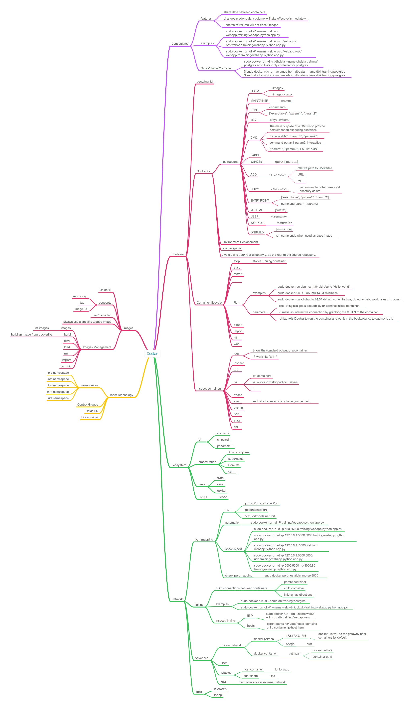

### 内容：

1. docker简单介绍
2. 什么是container，启动容器，容器相关命令使用
3. 什么是image，怎么构建镜像，镜像相关命令使用
4. registry上传、拉取镜像
5. docker-compose的简单使用

### 参考链接：

1. <https://docs.docker.com/reference/>（官方文档）
2. [https://yeasy.gitbooks.io/docker\_practice/](https://yeasy.gitbooks.io/docker_practice/)（docker从入门到实践 gitbook）
3. <http://open.daocloud.io/tag/allen-tan-docker/>（docker日志、镜像等详细深入理解文章）
4. <http://www.cnblogs.com/CloudMan6/>（docker每天5分钟系列，知识面较广）
5. <http://cizixs.com/>（进阶文章，较难）
6. <http://tonybai.com/articles/>（进阶文章，较难）

---

### docker知识点图：

